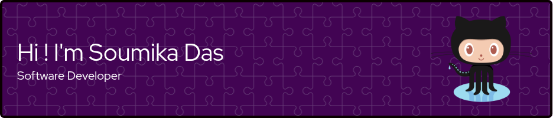
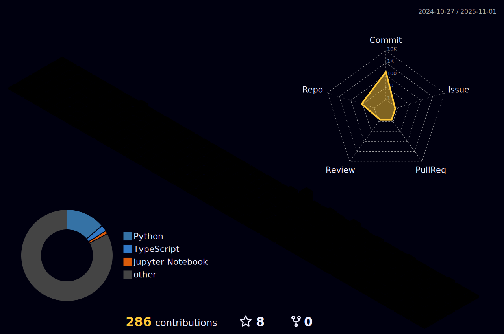

<h3 align="center">Social Media</h3>

    &nbsp;&nbsp;
    &nbsp;&nbsp;

<h3 align="center">GitHub Trophies</h3>

<h3 align="center">GitHub Stats</h3>

    
    

    
    &nbsp;&nbsp;
    

 
<h1 align=center>

:open_book: :books: Skilled in :closed_book: :desktop_computer:

</h1>

<h2>
    <b>Platform:</b> Linux, Windows
</h2>
<h2>
    <b>Languages:</b> Python, JavaScript, TypeScript, C, HTML, CSS
</h2>
<h2>
    <b>Backend:</b> Node, Express, FastAPI
</h2>
<h2>
    <b>Frontend:</b> React, Tailwind CSS
</h2>
<h2>
    <b>Database:</b> MongoDB, MySQL/MariaDB, PostgreSQL
</h2>

  

    

